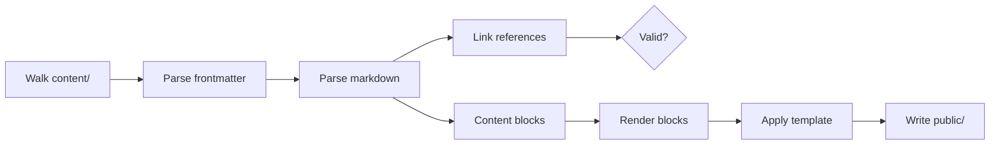
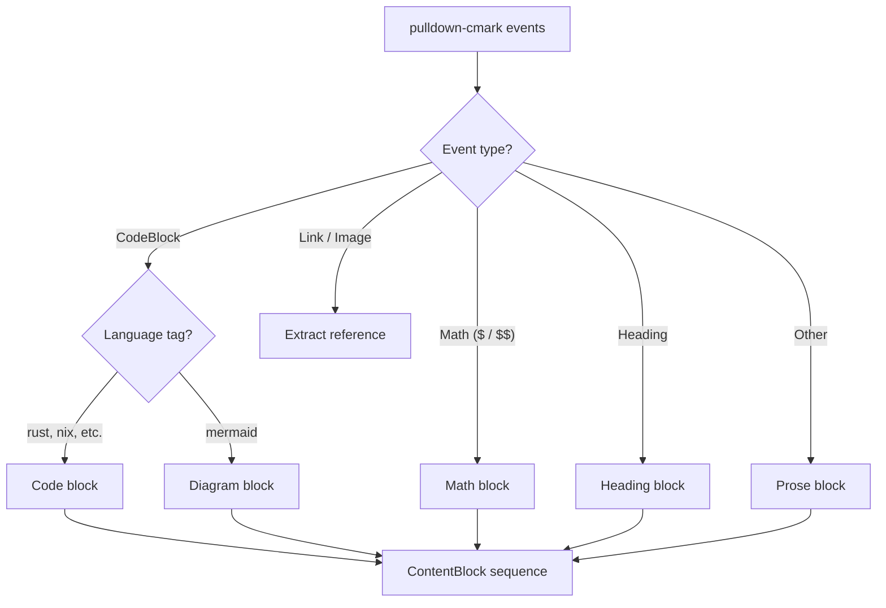

+++
title = "Architecture"
description = "How sukr transforms markdown into zero-JS static sites"
weight = 5
toc = true
+++

sukr is a 13-module static site compiler. Every feature that would typically require client-side JavaScript is moved to build-time.

## Pipeline Overview

The compiler runs in two phases:

1. **Discover** — walk the filesystem, parse frontmatter and markdown, extract typed content blocks and link references, build the navigation tree
2. **Render** — dispatch each content block to its renderer, apply templates, write output files



The discover phase also validates internal links — any `[link](../page.md)` pointing to a nonexistent page is reported as an error before rendering begins.

## Module Responsibilities

| Module               | Purpose                                                                  |
| :------------------- | :----------------------------------------------------------------------- |
| `main.rs`            | Pipeline orchestrator — wires discover and render phases together        |
| `config.rs`          | Loads `site.toml` configuration                                          |
| `content.rs`         | Content type system, section/page discovery, navigation, link validation |
| `render.rs`          | Block-by-block rendering — dispatches each content block to its renderer |
| `highlight.rs`       | Tree-sitter syntax highlighting (14 languages)                           |
| `math.rs`            | pulldown-latex rendering to MathML                                       |
| `mermaid.rs`         | Mermaid diagrams to inline SVG                                           |
| `css.rs`             | CSS bundling and minification via lightningcss                           |
| `template_engine.rs` | Tera template loading and rendering                                      |
| `feed.rs`            | Atom feed generation                                                     |
| `sitemap.rs`         | XML sitemap generation                                                   |
| `escape.rs`          | HTML/XML text escaping utilities                                         |
| `error.rs`           | Phase-split error types — parse errors vs compile errors                 |

## The Interception Pattern

The core innovation is **event-based interception**. Rather than parsing markdown into an AST and walking it twice, sukr streams `pulldown-cmark` events and intercepts specific patterns into typed content blocks:



Each content block carries its own data — language, math expression, diagram source, heading level + slug, or pre-rendered HTML prose. During the render phase, each block type is dispatched to its renderer independently.

Non-intercepted content (paragraphs, lists, emphasis, inline code) is rendered to HTML during parsing and emitted as prose blocks. Link URLs are extracted as a side-channel for reference validation.

## Why Zero-JS

Traditional SSGs ship JavaScript for:

| Feature                                                  | Typical Approach       | sukr Approach                                          |
| :------------------------------------------------------- | :--------------------- | :----------------------------------------------------- |
| [Syntax highlighting](features/syntax-highlighting.html) | Prism.js, Highlight.js | Tree-sitter at build-time → `<span class="hl-*">`      |
| [Math rendering](features/math.html)                     | MathJax, KaTeX.js      | pulldown-latex at build-time → MathML (browser-native) |
| [Diagrams](features/mermaid.html)                        | Mermaid.js             | mermaid-rs at build-time → inline SVG                  |
| Mobile nav                                               | JavaScript toggle      | CSS `:has()` + checkbox hack                           |

The result: **zero bytes of JavaScript** in the output. Pages load instantly, work without JS enabled, and avoid the complexity of client-side hydration.

## Static Configuration Pattern

Tree-sitter grammars are expensive to initialize. sukr uses [tree-house](https://github.com/helix-editor/tree-house) (Helix editor's Tree-sitter integration) with `LazyLock` to create language configurations exactly once:

```rust
/// Create a LanguageConfig for a language with embedded queries.
fn make_config(
    grammar: Grammar,
    highlights: &str,
    injections: &str,
    locals: &str,
) -> Option<LanguageConfig> {
    LanguageConfig::new(grammar, highlights, injections, locals).ok()
}

// Register Rust with embedded Helix queries
if let Ok(grammar) = Grammar::try_from(tree_sitter_rust::LANGUAGE)
    && let Some(config) = make_config(
        grammar,
        include_str!("../queries/rust/highlights.scm"),
        include_str!("../queries/rust/injections.scm"),
        include_str!("../queries/rust/locals.scm"),
    )
{
    config.configure(resolve_scope);
    configs.insert(Language::Rust, config);
}
```

This pattern ensures O(1) lookup per language regardless of how many code blocks exist in the site.

## Content Discovery

The `SiteManifest` struct aggregates all content in one filesystem traversal:

- Homepage (`_index.md` at root)
- Sections (directories with `_index.md`) — items sorted at discovery time
- Standalone pages (top-level `.md` files)
- Navigation tree (derived from sections and pages, ordered by weight)
- Internal link references (validated against known output paths)

This avoids repeated directory scans during template rendering. Broken internal links are caught before any rendering begins.

## Implementation Notes

sukr prioritizes **output quality** over minimal build-time footprint. Current dependency choices reflect this:

| Feature  | Library        | Trade-off                                                 |
| :------- | :------------- | :-------------------------------------------------------- |
| Math     | pulldown-latex | Pure Rust, 95% KaTeX parity; outputs native MathML        |
| Diagrams | mermaid-rs     | High-fidelity SVG; uses headless rendering under the hood |

Lighter alternatives exist and may be evaluated as they mature. The goal is browser-native output with zero client-side JavaScript—build-time weight is a secondary concern.
